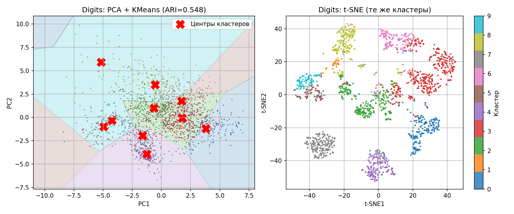
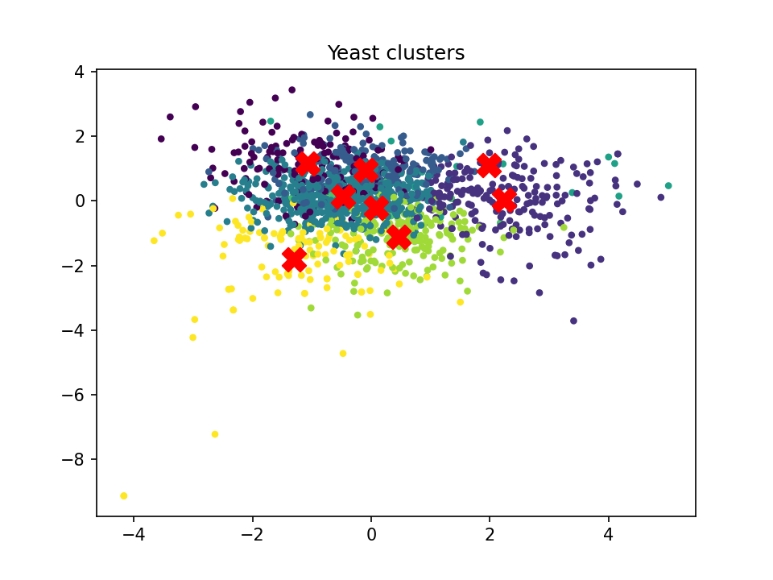

# Clustering Analysis (Digits & Yeast)

## 📌 Описание проекта

В данной работе исследуются методы обучения без учителя на примере кластеризации и снижения размерности данных.

Рассматриваются:

* алгоритм KMeans (разные инициализации)
* агломеративная кластеризация
* метод главных компонент (PCA)
* метод t-SNE для визуализации

---

## 📊 Датасеты

1. **Digits** — изображения рукописных цифр (64 признака)
2. **Yeast** — биологические данные о белках

---

## 🔬 Используемые методы

### Кластеризация:

* KMeans (k-means++)
* KMeans (random)
* KMeans (PCA init)
* Agglomerative Clustering

### Снижение размерности:

* PCA
* t-SNE

---

## 📈 Результаты

### Digits:

* Лучший результат показал **Agglomerative Clustering**
* PCA плохо разделяет данные в 2D
* t-SNE показывает чёткие кластеры

### Yeast:

* Низкое качество кластеризации (ARI ≈ 0.2)
* Данные имеют сложную структуру
* KMeans плохо подходит

---

## 📷 Примеры визуализации

### PCA vs t-SNE (Digits)



### Yeast Clustering



---

## 🧠 Выводы

* KMeans хорошо работает на простых данных
* PCA не всегда подходит для визуализации
* t-SNE лучше выявляет структуру данных
* Для сложных данных лучше использовать другие методы (DBSCAN, иерархические)

---

## ⚙️ Запуск

```bash
pip install -r requirements.txt
python lab1.py
```

---

## 📎 Автор

Студент Миронов Артём Б.ПИН.ИИ.24.16
